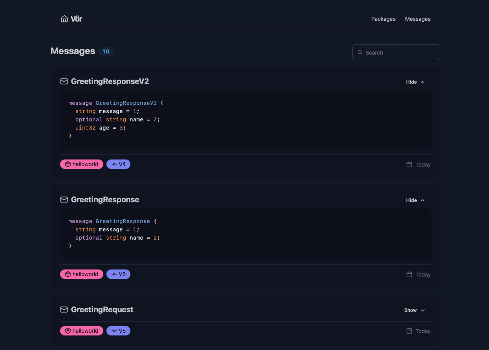

<div align="center">
  <h1>Vör</h1>
  <p><strong>Schema Registry for Protobufs</strong></p>
  <p><em>"Vör is wise and searching, so that nothing can be concealed from her. There is a saying that a woman becomes 'vör' (aware) of something when she finds it out."</em></p>
  
</div>

## Why?

Modern software systems are increasingly built on event-driven architectures and microservices that communicate through
well-defined interfaces. These systems need a robust way to manage their service contracts and message schemas.

Without proper schema management, teams risk introducing breaking changes that can cascade through their distributed
systems. A central schema registry ensures that all services speak the same language and evolve their interfaces safely
over time.

## What is Vör? 🌟

Vör is a schema registry for Protocol Buffers (protobufs) that provides:

- 📦 Central storage and versioning of protobuf schemas
- ✅ Backwards compatibility validation between schema versions
- 🖥️ Web UI for browsing and discovering schemas
- 🛠️ CLI tool for schema validation and publishing
- 🌐 Language-agnostic schema management - works with any programming language that supports protobufs

Vör is designed to be the central registry for managing and discovering protobuf schemas in your event-driven or gRPC
architectures.

## How it Works ⚙️

1. Developers create and maintain `.proto` files locally, defining their service interfaces and message types
2. Using the CLI tool, developers validate their proto packages to ensure compatibility with previous versions
3. Once validated, developers publish the package to the central registry
4. Consumers can discover and download schema versions through the web UI or CLI
5. The registry enforces backwards compatibility - preventing breaking changes between versions

Vör acts as the source of truth for your protobuf schemas. It helps teams collaborate by providing a central place to
publish, version, and discover service contracts while ensuring safe schema evolution over time.

## Installation

### CLI

`voer` is shipped as a single binary, or as a docker image.

```bash
wget voer-xx.xx.xx.tar.gz

tar -xf voer-xx.xx.xx.tar.gz -C /usr/local/bin
chmod +x /usr/local/bin/voer
```

## Getting Started

See the [following guide](./docs/02_getting_started.md) for basic instructions on using Vör.

## CLI Usage

### `validate`

The `validate` command is used to validate that a protobuf package.

```bash
# Example usage
voer validate --proto examples/helloworld/01_initial
```

### `upload`

The `upload` command is used to upload new package versions.

```bash
# Upload all proto files under a path
voer upload --proto examples/helloworld/01_initial

# Upload a specific proto file
voer upload --proto examples/helloworld/01_initial/helloworld.proto

# Upload with custom endpoint
voer upload --endpoint localhost:8000 --proto examples/helloworld/01_initial
```

#### Package

A package is defined by the `package` protobuf attribute. Example:

```proto
syntax = "proto3";

package voer.v1;

...
```

There are the following restrictions on how packages are structured:

1. All `.proto` files with the same package must be in the same directory
2. Messages must be unique across all `.proto` files within a package
3. Package names must be unique within the registry

### `download`

The `download` command is used to fetch a remote package version and save files locally.

```bash
# Download a package version to the current directory
voer download --package helloworld --version 1

# Download to a specific directory
voer download --package helloworld --version 1 --output ./protos

# Download with custom endpoint
voer download --endpoint localhost:8000 --package helloworld --version 1
```

### `server`

The `server` command starts the web server.

```bash
# Start the server with default configuration
voer server

# Start with custom gRPC port
voer server --grpc-port 9000
# Or using environment variables
export VOER_GRPCPORT=9000
voer server

# Start with custom frontend port
voer server --frontend-port 3000
# Or using environment variables
export VOER_FRONTENDPORT=3000
voer server

# Start with custom database path
export VOER_SQLITEDBPATH=/path/to/db.sqlite
voer server

# Start with all custom options
export VOER_GRPCPORT=9000
export VOER_FRONTENDPORT=3000
export VOER_SQLITEDBPATH=/path/to/db.sqlite
voer server
```

## Development

For documentation pertaining to contributing to this repo, check the [related guide](./docs/01_development.md)
