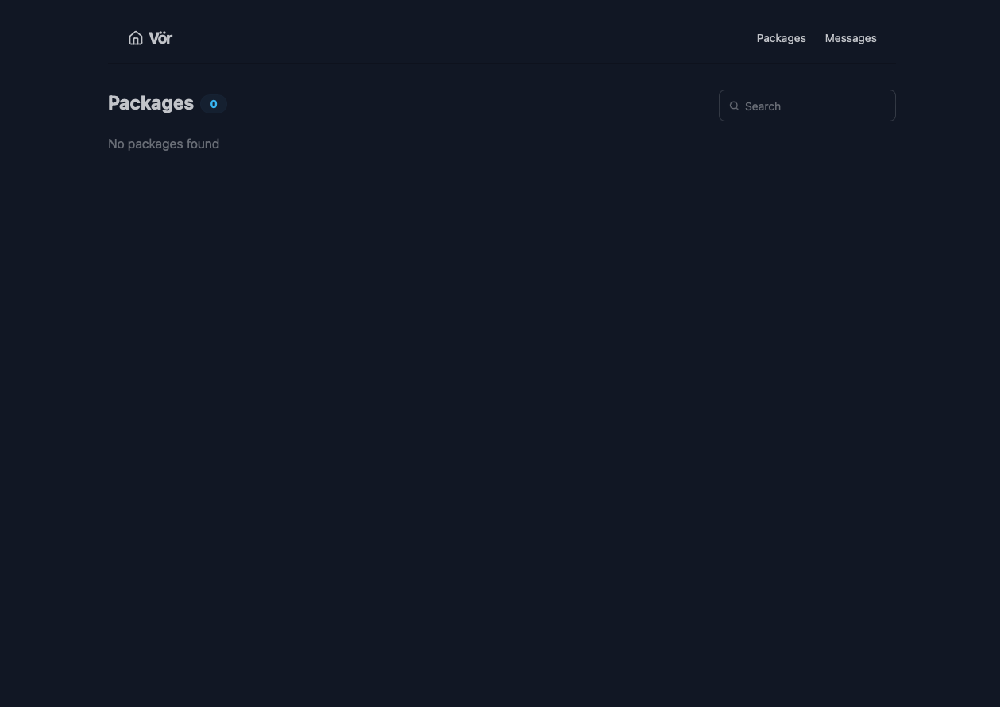
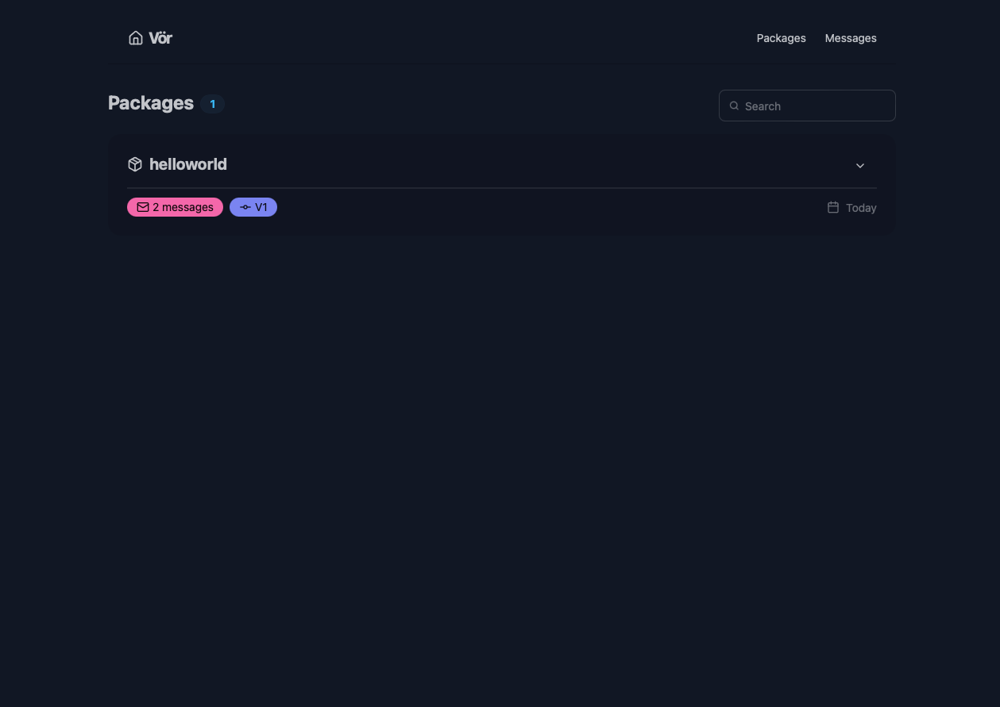

# Getting Started with Vör

## Installation

### CLI

`voer` is shipped as a single binary, or as a docker image.

```bash
wget voer-xx.xx.xx.tar.gz

tar -xf voer-xx.xx.xx.tar.gz -C /usr/local/bin
chmod +x /usr/local/bin/voer
```

### Docker

```bash
docker pull cgundlach/voer:latest
```

## Start registry server

First we need to start the registry service.

```bash
# Start with CLI
voer server --grpc-port 8000 --frontend-port 8080

# Start with docker
docker compose run voer server
# Or start in the background
docker compose up -d voer
```

You should be able to view the frontend at [http://localhost:8080](http://localhost:8080).



## Upload a new schema

Our registry is currently empty, so let's start by uploading our first package, `helloworld`.

```bash
# Should be port 8000 on the server
export VOER_GRPCENDPOINT=localhost:8000

# Validate schema
voer validate --proto examples/helloworld/01_initial

# Upload schema
voer upload --proto examples/helloworld/01_initial
```

After uploading, you should see the package in the UI.



## Upload a new package version

Let's make a change to our schema by adding a field to an existing message and introducing a new message.

```bash
# Validate schema
voer validate --proto examples/helloworld/02_valid_changes

# Upload schema
voer upload --proto examples/helloworld/02_valid_changes
```

You should now see the updated messages and package version in the UI.

## Attempting a breaking change

Let's see what happens when we try to make a breaking change to our schema.

```bash
# Validate schema. This should fail
voer validate --proto examples/helloworld/03_remove_field

# Upload schema. This should fail
voer upload --proto examples/helloworld/04_remove_message
```

All attempts to make a breaking change to the schema should fail.

## Conclusion

This guide demonstrated the core functionality of Vör:

- Creating and uploading new protobuf packages
- Making backwards-compatible changes to existing schemas
- Protection against breaking changes through validation

Vör helps teams maintain schema compatibility as their services evolve by:

For more details on using Vör in your development workflow, check out the [CLI documentation](../README.md#cli-usage).
